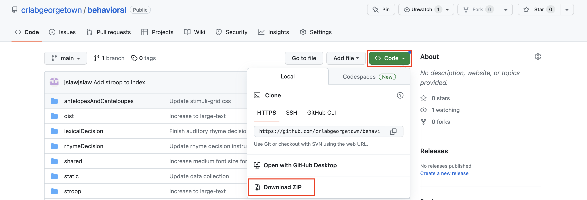

# Setup

1. Install git based on the operating system you use. Instructions [here](https://git-scm.com/book/en/v2/Getting-Started-Installing-Git)
1. In a local directory of your choosing, run the following command from your terminal:
```sh
git clone https://github.com/crlabgeorgetown/behavioral.git
```
Or, download the zip archive from github and unzip it. 


# Running

1. To test a task locally, from the behavioral directory, run:
```sh
open lexicalDecision/writtenIndex.html
```
1. You can open and file ending in index.html (i.e. `antelopesAndCanteloupes/unrelatedIndex.html`).

# Development

1. This project uses webpack for organizational purposes. It bundles together modules that depend on each other and produces a bundle.js file that is embedded in a Qualtrics question. Without it, it would be cumbersome and error prone to add all the modules necessary for the tasks to work as script tags. You can read more about webpack basic concepts [here](https://webpack.js.org/concepts/). However, in order to use webpack, you need to install Node from [here](https://nodejs.org/en).
1. run: 
```sh
npx webpack --watch
```
1. Webpack is now listening for changes made to the Javascript code, and updating the bundle.js file immediately. 
1. Bundles are deployed to github pages after pushing to the `main` branch.

# Visual Components #

Tutorial on how to use different components, with visual and coding examples.

This also includes other Container objects used throughout different tasks. Like audio, video, instructional buttons, typing, and other elements used to create trial or instructional screens.

These are all HTML components.

___
### ~~~ PLEASE READ ME ~~~ ###

**These components are used by all tasks. Editing them and their styling will affect any tasks that use these objects.** Only change the source file if the component needs to be changed for all tasks. Only change the styling if the component needs to be changed for all tasks.

Change styling at the local level for a fine tune change of components. Style changing included along with other examples in the following.
___

## Location ##

Components can be found in `crlabgeorgetown/behavioral/shared/components/`.

Styling for components, texts, and images can be found in `crlabgeorgetown/behavioral/shared/styles`.

## Use ##

When setting up a 

## Components ##

### Audio ###

`AUDIO_CONTAINER`

### Video ###

`VIDEO_CONTAINER`

### Text ###

`TEXT_CONTAINER`

Simple container to display text. No strict formatting, would probably show up in the middle of the screen when placed alone. 
___

<html>
<body>
<div id="TEXT_CONTAINER" class="base-text extra-large-text large-fixed-height" >
+ This is more testing for the page to reload with more space
</div>
</body>
</html>

___

```
const TEXT_CONTAINER = jQuery("<div/>", {id: 'textContainer'})
```

In use, `task/screens/trials/wordToPicture.js` line 99:
```
[TEXT_CONTAINER, {text: '+', addClass: 'base-text extra-large-text large-fixed-height'}]
```

`TEXT_CRESP_CONTAINER`

While not too different from `TEXT_CONTAINER`, this text container allows words to be displayed at the center of the screen, regardless of other components. This simplifies formats for the other components. 

___


___

`SIX_LETTER_CONTAINER`

`FOUR_LETTER_CONTAINER`

`ARIZONA_TEXT_CONTAINER`

`TWO_LETTER_CONTAINER`

`ONE_LETTER_CONTAINER`


### Images ###

Contain images with formatting. 

`IMAGE_CONTAINER`

`FOUR_IMAGE_CONTAINER`

`ARIZONA_IMAGE_CONTAINER`

`ONE_IMAGE_CONTAINER`

### Typing ###

`TYPING_CONTAINER`

### Trial ###

`REPLAY_CONTAINER`

`BUTTON_CONTAINER`

`BUTTON_LABEL_CONTAINER`

`PROCEED_CONTAINER`

`STOP`


### Instructional ###

`BEGIN_OR_PRACTICE_CONTAINER`

`INPUT_DEVICE_CONTAINER`

`INPUT_DEVICE_LABEL_CONTAINER`

`INSTRUCTIONAL_BUTTON_CONTAINER`

`PARTICIPANT_ID_CONTAINER`

### Other ###

`CONTAINER`

## Styling ##

Styling classes availble:

### `test.css` ###

* `base-text`


<style>
html, body {
    overflow: hidden;
    touch-action: none;
}

video {
    object-fit: fill;
    aspect-ratio: 16 / 9;
    width: 50%;
    border: 2px solid;
}

.typing-container {
    display: flex;
}

.typing-input {
    color: black;
    background: rgb(240, 240, 240);
    font-family: Arial;
    font-size: 60pt;
    text-align: center;
    border: none;
}

.blinking-caret {
    font-family: Arial;
    font-size: 60pt;
    animation: blink 1s step-end infinite;
    color: black;
}

@keyframes blink {
    from,
    to {
      color: transparent;
    }
    50% {
      color: black;
    }
  }

  .base-text {
    display: flex;
    justify-content: center;
    align-content: center;
    text-align: center;
    flex-direction: column;
    color: #000000;
    white-space: pre-line;
    line-height: 1.7em;
    margin-top: auto;
    margin-bottom: auto;
    font-family: Arial;
}

.extra-large-text {
    font-size: 60pt;
}

.large-text {
    font-size: 44pt;
}

.medium-text {
    font-size: 33pt;
}

.small-text {
    font-size: 20pt;
}

.extra-small-text {
    font-size: 14pt;
}

.fixed-height {
    height: 90px;
}

.medium-fixed-height {
    height: 225px;
}

.large-fixed-height {
    height: 275px;
}

.blue {
    color: #0000FF;
}

.red {
    color: #FF0000
}

.green {
    color: green
}

/* Landscape */
@media only screen
  and (min-device-width: 768px)
  and (max-device-width: 1024px)
  and (orientation: landscape)
  and (-webkit-min-device-pixel-ratio: 2) {
    .large-text {
        font-size: 33pt;
    }

    .medium-text {
        font-size: 27pt;
    }
}

.stop {
    width: 30%;
    height: 70%;
    margin: auto;
    margin-bottom: 20px;
}

.instruction-button-container {
    display: flex;
    flex-direction: row;
    justify-content: flex-end;
    min-width: 100%;
    margin-top: auto;
    margin-bottom: 4vh;
    font-family: Arial;
    text-align: center;
    padding: 12px;
}

.image-button {
    background: #f0f0f0;
    border-style: solid;
    border-color: #f0f0f0;
    border-width: 2px;
    border-radius: 20px;
    touch-action: manipulation;
    padding: 12px;
    width: 200px;
    height: 200px;
}

.image-button:active {
    background: #d8d8d8;
    border-color: #e9d700;
    border-style: solid;
    border-width: 2px;
}

.grey-button {
    color: #000000;
    background: #a8a8a8;
    border-color: #adb1b8 #a2a6ac #8d9096;
    border-style: solid;
    border-width: 2px;
    border-radius: 3px;
    touch-action: manipulation;
    padding: 12px;
}

.grey-button:active {
    background: #B0B0B0;
    border-color: #e9d700;
    border-width: 2px;
}

@media (hover: hover) {
    .image-button:hover {
        background: #d8d8d8;
        cursor: pointer;
    }

    .grey-button:hover {
        background: #B0B0B0;
        cursor: pointer;
    }
}

.fixed-width {
    width: 150px;
}

.large-button-text {
    font-size: 25pt;
}

.medium-button-text {
    font-size: 22pt;
}

.right-margined {
    margin-right: 2.5%;
    margin-left: auto;
}

.left-margined {
    margin-left: 2.5%;
    margin-right: auto;
}

.right-chevron {
    padding: 2px;
    width: 100px;
    height: 100px;
    border: solid 3px transparent;
    margin-right: auto;
    margin-left: 10%;
}

.right-chevron:hover {
    cursor: pointer;
}

.right-chevron:active {
    background: #d7d7d7;
    border: solid 3px #000000;
    border-radius: 3px;
}

/* Portrait */
@media only screen 
  and (min-device-width: 768px) 
  and (max-device-width: 1024px) 
  and (orientation: portrait) 
  and (-webkit-min-device-pixel-ratio: 2) {
    .instruction-button-container {
        margin-bottom: 8vh;
    }
}


.button-label {
    color: #000000;
    padding: 1%;
    justify-content: center;
    display: flex;
    width: 200px;
    height: 35px;
    font-size: 30px;
}

.response-button-container {
    display: flex;
    flex-direction: row;
    justify-content: flex-end;
    min-width: 100%;
}

.four-image-container{
    display: grid;
    grid-template-columns: 1fr 1fr;
    grid-template-rows: 1fr 1fr;
    gap: 10vw;
    justify-content: center;
    align-items: center;
    width: 90vw;
    padding: 5vw;
    position: relative;
}

.four-image-container-instruction{
    display: grid;
    gap: 7vw;
    grid-template-columns: 1fr 1fr;
    grid-template-rows: 1fr 1fr;
    justify-content: center;
    align-items: center;
    width: 55vw;
    padding: 5vw;
    position: relative;
}

.image-container{
    justify-content: center;
    align-items: center;
    background-color: white;
    color: black;
    border: 2px solid #ccc;
    box-sizing: border-box;

    width: 100%;
    height: 100%;
    object-fit: contain;
}

.image-container:hover{
    border: 2px solid black;
}

.image-container:active{
    background-color: #ccc;
}

/* 
 * testing with overlaying things over each other
 * instead of adding a text container to the image container
 */

.overlay-container{
    position: absolute;
    top: calc(50%);
    left: calc(50%);
    transform: translate(-50%, -50%);
    z-index: 5;
}

.overlay-container-instruction{
    position: absolute;
    top: calc(33%);
    left: calc(50%);
    transform: translate(-33%, -50%);
    z-index: 5;
}

.arizona-container{
    position: relative;
    width: 90vw;
    height: 60vw;
}

.arizona-image{
    position: absolute;
    width: 25vw;
    height: 20vw;
    aspect-ratio: 203/144;
    object-fit: contain;
    border: 2px solid white;
    box-sizing: border-box;
    background-color: white;
}

.arizona-image:hover{
    border: 2px solid black;
}

.arizona-image:active{
    background-color: white;
}

.arizona-target-image{
    position: absolute;
    width: 25vw;
    height: 20vw;
    aspect-ratio: 203/144;
    object-fit: contain;
    top: 50%;
    left: 50%;
    transform: translate(-50%, -50%);
    pointer-events: none;
    border: 2px solid black;
    box-sizing: border-box;
    background-color: white;
}

.AZTL{
    top: 5%;
    left: 5%;
}

.AZTR{
    top: 5%;
    right: 5%;
}

.AZBL{
    bottom: 5%;
    left: 5%;
}

.AZBR{
    bottom: 5%;
    right: 5%;
}

.top-image-container{
    justify-content: center;
    align-items: center;
    box-sizing: border-box;
    aspect-ratio: 710/443;

    width: 65vw;
    height: 40vh;
    object-fit: contain;
}

.one-image-container{
    display: grid;
    justify-content: center;
    align-items: center;
    width: 45vw;
    height: 50vh;
    padding: 5vw;
    grid-template-columns: 1fr;
}


.device-label {
    color: #000000;
    width: 15%;
    margin-left: auto;
    margin-right: auto;
    text-align: center;
    font-size: 25px;
}

.device-button {
    width: 15%;
    margin-left: auto;
    margin-right: auto;
}

.device-container {
    display: flex;
    flex-direction: row;
    justify-content: flex-end;
    min-width: 100%;
    margin-top: auto;
}

.device-label-container {
    display: flex;
    flex-direction: row;
    justify-content: flex-end;
    min-width: 100%;
    margin-top: 2.5%;
    margin-bottom: auto;
    font-family: Arial;
}

.device-hover {
    background: #B0B0B0;
    cursor: pointer;
}

/* Media Query for low resolution  Tablets, Ipads */
@media (min-width: 481px) and (max-width: 767px) {
    .device-label {
        font-size: 25px;
    }
}

.six-grid-container {
    display: grid;
    gap: 2vw;
    row-gap: 5vh;
    justify-content: center;
    align-content: center;
    width: 90vw;
    height: 75vh;
    padding: 5vw;
}

.six-grid-container-instruction {
    display: grid;
    gap: 3vw;
    justify-content: center;
    align-content: center;
    width: 90vw;
    height: 45vh;
    padding: 5vw;
}

.six-letter-container {
    grid-template-columns: 1fr 1fr 1fr;
    grid-template-rows: 1fr 1fr;
}

.four-grid-container {
    display: grid;
    gap: 4vw;
    justify-content: center;
    align-content: center;
    width: 90vw;
    height: 90vh;
    padding: 5vw;
}

.four-grid-container-instruction {
    display: grid;
    gap: 2vw;
    justify-content: center;
    align-content: center;
    width: 60vw;
    height: 60vh;
    padding: 5vw;
}

.four-letter-container {
    grid-template-columns: 1fr 1fr;
    grid-template-rows: 1fr 1fr;
}

.letter-container {
    display: flex;
    justify-content: center;
    align-items: center;
    background-color: white;
    color: black;
    border: 2px solid #ccc;
    box-sizing: border-box;

    height: 100%;
    width: 100%;
}

.letter-container:hover {
    border: 2px solid black;
}

.letter-container:active {
    background-color: #ccc;
}

.two-letter-container {
    display: grid;
    gap: 15vw;
    justify-content: center;
    align-items: center;
    width: 85vw;
    height: 50vh;
    padding: 5vw;
    grid-template-columns: 1fr 1fr;
}

.one-letter-container {
    display: grid;
    justify-content: center;
    align-items: center;
    width: 42.5vw;
    height: 50vh;
    padding: 5vw;
    grid-template-columns: 1fr;
}

.top-image-2 {
    display: flex;
    justify-content: center;
    align-items: center;
    background-color: white;
    color: black;
    border: 2px solid #ccc;
    box-sizing: border-box;

    height: 100%;
    width: 100%;
}

.divider {
    width: 100%;
    size: 2px;
    background-color: black;
}


.participant-id-container {
    display: flex;
    flex-wrap: wrap;
    flex-direction: row;
    font-family: Arial;
    align-items: center;
    min-width: 100%;
}

.participant-id-label {
    font-size: 35pt;
    color: #000000;
    margin-left: auto;
    margin-right: 20px;
}

.participant-id-input {
    font-size: 25px;
    padding: 12px;
    width: 275px;
}

/* Media Query for Mobile Devices */
@media (max-width: 480px) {
    
}
    
/* Media Query for low resolution  Tablets, Ipads */
@media (min-width: 481px) and (max-width: 767px) {
    .participant-id-label {
        width: 100%
    }
}
    
/* Media Query for Tablets Ipads portrait mode */
@media (min-width: 768px) and (max-width: 1024px) {
    
}
    
/* Media Query for Laptops and Desktops */
@media (min-width: 1025px) {
    
}

</style>
