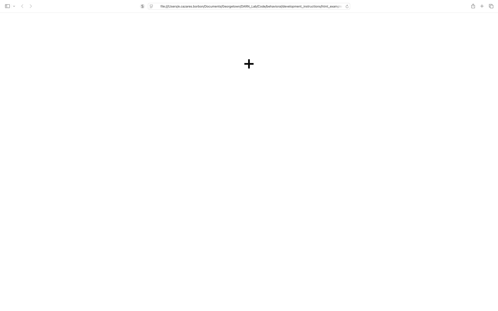

# Components #

Tutorial on how to use different components, with visual and coding examples.

This also includes other Container objects used throughout different tasks. Like audio, video, instructional buttons, typing, and other elements used to create trial or instructional screens.

These are all HTML components.

___
### ~~~ PLEASE READ ME ~~~ ###

**These components are used by all tasks. Editing them and their styling will affect any tasks that use these objects.** Only change the source file if the component needs to be changed for all tasks. Only change the styling if the component needs to be changed for all tasks.

Change styling at the local level for a fine tune change of components. Style changing included along with other examples in the following.
___

## Location ##

Components can be found in `crlabgeorgetown/behavioral/shared/components/`.

Styling for components, texts, and images can be found in `crlabgeorgetown/behavioral/shared/styles`.

## Use ##

When setting up a new task, you may use these components sample code and screenshots of the various components are below.

In practice, the containers are added in order as they are added to the map of containers. For example, from `task/screens/trials/wordToPicture.js` lines 8-14:
```
get components() {
        return new Map([
            [FOUR_IMAGE_CONTAINER, {addClass: 'four-image-container'}],
            [TEXT_CRESP_CONTAINER, {addClass: 'base-text extra-large-text large-fixed-height overlay-container'}],
            [TEXT_CONTAINER, {text: '+', addClass: 'base-text extra-large-text large-fixed-height'}]
        ])
    }
```
the `FOUR_IMAGE_CONTAINER` will appear before all the other components (top to bottom). Sometimes, when conducting tasks, you may need to hide some components on the page; you may hide and show different components at different times with the following functions in the following example. Again from `task/screens/trials/wordToPicture.js` lines 57-58:
```
TEXT_CONTAINER.hide()
FOUR_IMAGE_CONTAINER.show()
```
For more examples, please check out the different tasks.

To see these components in action, please check out the Component Sample Task. A mock task (no data is being collected nor sent anywhere) to showcase the components with names. Please refer back to this document for more details on implementing. 

# Components #

## Audio ##

### `AUDIO_CONTAINER` ###
___


___
This container allows browser to play audio. Does not really take up space on screen.

```
const AUDIO_CONTAINER = jQuery("<audio/>", {id: 'audioContainer'})
const AUDIO_SOURCE = jQuery("<source/>", {id: 'audioSource', type: 'audio/wav'})
```
In use, `task/screens/trials/auditory.js` lines 12, 54-55, 59:
```
[AUDIO_CONTAINER, {}]

...

AUDIO_SOURCE.attr('src', this.orchestrator.currentTrial.audioSource())
AUDIO_CONTAINER[0].load()

...

AUDIO_CONTAINER[0].play()
```
Where audio file is linked in `this.orchestrator.currentTrial.audioSource()`, any audio source link and be placed here.

*More details on audio coming soon*

## Video ##

### `VIDEO_CONTAINER` ###
*More detail on video coming soon*

## Text ##

### `TEXT_CONTAINER` ###
___


___

Simple container to display text. No strict formatting, would probably show up in the middle of the screen when placed alone. 

```
const TEXT_CONTAINER = jQuery("<div/>", {id: 'textContainer'})
```

In use, `task/screens/trials/wordToPicture.js` line 99:
```
[TEXT_CONTAINER, {text: '+', addClass: 'base-text extra-large-text large-fixed-height'}]
```
Where the displayed text is "+" and the classes are formatting styles defined in CSS files.

### `TEXT_CRESP_CONTAINER` ###
___


___
While not too different from `TEXT_CONTAINER`, this text container allows words to be displayed at the center of the screen, regardless of other components. This simplifies formats for the other components.

```
const TEXT_CRESP_CONTAINER = jQuery('<div/>', {
    id: 'text-cresp-container',
    class: 'base-text extra-large-text large-fixed-height overlay-container',
    text: ''
})
```

In use, `task/screens/trials/wordToPicture.js` lines 98, 137:
```
[TEXT_CRESP_CONTAINER, {addClass: 'base-text extra-large-text large-fixed-height overlay-container'}]

...

TEXT_CRESP_CONTAINER.text(this.orchestrator.currentTrial.CRESP)
```
Where the displayed text is `this.orchestrator.currentTrial.CRESP`. The classes are formatting styles defined in CSS files, particularily special for this component is the `overlay-container` class, which keeps the container in the center of the screen.

### `SIX_LETTER_CONTAINER` ###
___


___


```

```

In use, `` line

```

```
TODO: Explain more detail about use

### `FOUR_LETTER_CONTAINER` ###
___


___
TODO: Explain container

```

```

In use, `` line

```

```
TODO: Explain more detail about use

### `ARIZONA_TEXT_CONTAINER` ###
___


___
TODO: Explain container

```

```

In use, `` line

```

```
TODO: Explain more detail about use

### `TWO_LETTER_CONTAINER` ###
___


___
TODO: Explain container

```

```

In use, `` line

```

```
TODO: Explain more detail about use

### `ONE_LETTER_CONTAINER` ###
___


___
TODO: Explain container

```

```

In use, `` line

```

```
TODO: Explain more detail about use

## Images ##

Contain images with formatting. 

### `IMAGE_CONTAINER` ###
___


___
TODO: Explain container

```

```

In use, `` line

```

```
TODO: Explain more detail about use

### `FOUR_IMAGE_CONTAINER` ###
___


___
TODO: Explain container

```

```

In use, `` line

```

```
TODO: Explain more detail about use

### `ARIZONA_IMAGE_CONTAINER` ###
___


___
TODO: Explain container

```

```

In use, `` line

```

```
TODO: Explain more detail about use

### `ONE_IMAGE_CONTAINER` ###
___


___
TODO: Explain container

```

```

In use, `` line

```

```
TODO: Explain more detail about use

## Typing ##
___


___
TODO: Explain container

```

```

In use, `` line

```

```
TODO: Explain more detail about use

### `TYPING_CONTAINER` ###
___


___
TODO: Explain container

```

```

In use, `` line

```

```
TODO: Explain more detail about use

## Trial ##

### `REPLAY_CONTAINER` ###
___


___
TODO: Explain container

```

```

In use, `` line

```

```
TODO: Explain more detail about use

### `BUTTON_CONTAINER` ###
___


___
TODO: Explain container

```

```

In use, `` line

```

```
TODO: Explain more detail about use

### `BUTTON_LABEL_CONTAINER` ###
___


___
TODO: Explain container

```

```

In use, `` line

```

```
TODO: Explain more detail about use

### `PROCEED_CONTAINER` ###
___


___
TODO: Explain container

```

```

In use, `` line

```

```
TODO: Explain more detail about use

### `STOP` ###
___


___
TODO: Explain container

```

```

In use, `` line

```

```
TODO: Explain more detail about use


## Instructional ##

### `BEGIN_OR_PRACTICE_CONTAINER` ###
___


___
TODO: Explain container

```

```

In use, `` line

```

```
TODO: Explain more detail about use

### `INPUT_DEVICE_CONTAINER` ###
___


___
TODO: Explain container

```

```

In use, `` line

```

```
TODO: Explain more detail about use

### `INPUT_DEVICE_LABEL_CONTAINER` ###
___


___
TODO: Explain container

```

```

In use, `` line

```

```
TODO: Explain more detail about use

### `INSTRUCTIONAL_BUTTON_CONTAINER` ###
___


___
TODO: Explain container

```

```

In use, `` line

```

```
TODO: Explain more detail about use

### `PARTICIPANT_ID_CONTAINER` ###
___


___
TODO: Explain container

```

```

In use, `` line

```

```
TODO: Explain more detail about use

## Other ##

### `CONTAINER` ###

# Styling #

Styling classes availble:

## `test.css` ##

* `base-text`